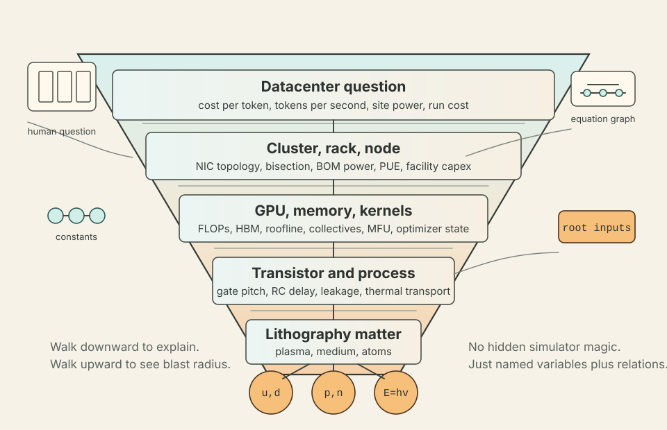

# gpu_stack


**Website:** <https://cuuper22.github.io/gpu_stack-/><br>
**Repository:** <https://github.com/Cuuper22/gpu_stack-><br>

**Causal observatory:** <https://cuuper22.github.io/gpu_stack-/observatory.html><br>
**Research program:** [RESEARCH.md](RESEARCH.md)

`gpu_stack` started as a curiosity project in the overlap between my AI work and my physics brain.

The question was simple enough to be annoying: if frontier training is supposedly "more GPUs, more data, more money," where does that sentence actually bottom out?

Not rhetorically. Physically.

A token passes through model architecture, kernels, collectives, memory bandwidth, transistor switching, lithography, materials, thermals, power delivery, and eventually a cost line item that someone has to pay. The stack is usually explained in slices. I wanted the uncomfortable version where the slices have to talk to each other.

That symbolic graph is still the causal backbone, but it is no longer the
project's finish line.

GPUSTACK is becoming a causal, uncertainty-aware virtual AI datacenter. It
combines three expressions of one system:

- an engine that predicts temporal execution, state movement, failures,
  facility power, economics, and eventually learning or service outcomes;
- a visual observatory that can explain the same result at freshman,
  researcher, or full-trace depth without changing the underlying truth;
- a research lab that turns frontier systems questions into preregistered,
  falsifiable experiments before asking for datacenter-scale validation.

Measurements calibrate the engine. The engine powers the explanation. The
explanation exposes the hypothesis and its assumptions. Experiments produce
new measurements. That loop is the telos now.

If that sounds like a weird amount of effort to understand GPU training, yes. That is more or less how the project happened.

## The Shape Of The Stack



`gpu_stack` treats the training stack like one inspectable dependency cone.

At the wide end are questions people actually ask:

- What sets `econ.cost.per_token`?
- Why did `training.tokens_per_second` move?
- How much site power disappears into cooling?
- Which missing assumptions matter most downstream?

At the narrow end are the things the model refuses to pretend away: process geometry, pulse fluence, imaging-medium composition, gate constraints, source-plasma behavior, proton and neutron counts, valence quark roots, and universal constants.

Most tooling stops at the first satisfying number. `gpu_stack` keeps asking: what is that number made of?

The answer can be an equation, a sourced scenario value, a universal constant, or a root input. Root inputs are not a shame pile. They are visible modeling debt, which is much better than hidden modeling debt wearing a lab coat.

## The Central Idea

The core object is a registry-backed equation graph.

Every scope self-registers on import. Variables carry identity, units, descriptions, scope metadata, symbolic assumptions, and back-references for graph traversal. Equations define relations between variables. Constants are reserved for universal physics constants. Everything else, including clocks, voltages, tensor shapes, optimizer hyperparameters, GPU counts, tariffs, and facility assumptions, remains a variable.

That choice matters.

A variable with no defining value relation is a root input. Some roots should eventually be decomposed into lower-level physics. Some should remain scenario boundaries. Some require sourced calibration before the model is allowed to assign them.

This is why root count alone is not the score. Decomposing one vague root into several primitive roots can make the count rise while making the model more honest.

The research score is held-out predictive error, uncertainty coverage,
configuration ranking, intervention regret, time to a learning or service
target, facility energy and power behavior, and whether a preregistered
hypothesis survives evidence. Equation count, root count, and passing tests are
diagnostics. They are not research results.

## What The Graph Knows Right Now

Fresh local `stats` output reports:

```text
Registry stats:
  systems        16
  variables      1517
  constants      24
  equations      959
  root_inputs    619
  leaves         253

Coverage:
  non_constant_variables         1493
  with_sp_units                  1493
  with_references                1493
  equations                      959
  equations_with_references      959
  equations_with_unit_check      893
```

The model spans:

| Layer | What lives there |
|---|---|
| Physical roots | lithography source structure, imaging-medium composition, process geometry, local thermal behavior, semiconductor transport, MOSFET behavior, interconnect physics, CMOS logic, noise |
| Memory | SRAM, DRAM, flip-flops, register file, shared memory, Tensor Memory, L1, L2, HBM capacity and bandwidth |
| Numeric formats | IEEE formats, low-bit precision, microscaling, stochastic rounding |
| Parallelism | data, tensor, pipeline, expert, context, and FSDP style sharding |
| Model architecture | attention, embeddings, FFN, MoE, positions, KV cache, transformer parameter and token math |
| Arithmetic and kernels | ALU, FMA, Tensor Core MMA, roofline, GEMM, attention kernels, occupancy |
| Communication | NVLink, InfiniBand, Spectrum-X-style scale-out, collectives, alpha-beta costs |
| Training | compute time, communication time, bubbles, MFU, tokens per second |
| Cluster and facility | nodes, racks, bisection, storage, reliability, power, cooling, PUE |
| Economics | capex, opex, amortization, power cost, run cost, cost per token |

MFU means Model FLOPs Utilization. HBM means High Bandwidth Memory. PUE means Power Usage Effectiveness. The README should not assume the reader was born knowing datacenter abbreviations. Sadly, many datacenter docs do.

## Try It Without Believing Me

Install in editable mode:

```bash
python -m pip install -e ".[dev]"
```

Run the quick health check:

```bash
python -m gpu_stack.cli stats
```

Run the verifier while iterating:

```bash
python -m gpu_stack.cli verify --profile fast
python -B -m gpu_stack.cli verify --profile fast --read-only
```

Before broader graph edits, use the full verifier:

```bash
python -m gpu_stack.cli verify --profile full
```

The installed entry point is also available as:

```bash
gpu-stack stats
gpu-stack verify --profile fast
```

## See One Output As A Cone

Start with a target such as `econ.cost.per_token`.

```python
import gpu_stack
from gpu_stack import Registry, subgraph

target = Registry.variables["econ.cost.per_token"]
cone = subgraph(target, direction="dependencies")

print(target.name)
print(f"{len(cone)} variables upstream")
print("first few roots:")

roots = sorted((v for v in cone if v.is_root_input), key=lambda v: v.name)
for var in roots[:12]:
    print("  ", var.name, f"[{var.units}]")
```

The exact count is not the important part. The posture is. Every cost number has an ancestry, and every unresolved ancestor is named.

## Root Debt

`root-debt` ranks unresolved root inputs by downstream blast radius.

```bash
python -m gpu_stack.cli root-debt --families --limit 5
```

Observed summary:

```text
Root-debt family ranking:
  total_roots        619
  include_constraints False
  grouped_roots      619
  family_count       151
  shown              5

total_weight  root_count  family                                      boundary_category  primitive_boundary
        3014          15  physical.lithography.medium                 primitive-root     True
        2185          11  physical.lithography                        primitive-root     True
        1943           8  physical.lithography.source_plasma_drive    primitive-root     True
        1866          18  physical.mosfet                             primitive-root     True
        1293           8  physical.process                            primitive-root     True
```

The live table also appends a `top_roots` column naming the heaviest
individual roots per family, truncated here for line width.

This is one of the more useful commands because it prevents the project from drifting into "add equations wherever it feels cool." The graph can tell which unknowns are currently expensive.

## Scenario Reports

Presets can evaluate named targets and return structured artifacts.

```python
from gpu_stack.presets import scenarios

report = scenarios.dense_training_cost_fixture.evaluate_targets([
    ("tokens_per_second", "training.tokens_per_sec"),
    ("job_dc_power", "econ.job.dc_power"),
    ("run_power_cost", "econ.run.power_cost"),
    ("cost_per_token", "econ.cost.per_token"),
])

print(report.status)
for target in report.targets:
    print(target.label, target.status, target.missing_count)
```

The CLI equivalent:

```bash
python -m gpu_stack.cli scenario-report scenarios.dense_training_cost_fixture --json
```

Observed summary:

```json
{
  "preset": "dense_training_cost_fixture",
  "status": "ok",
  "assignment_count": 30,
  "target_count": 4,
  "ok_count": 4,
  "error_count": 0,
  "issue_count": 0,
  "ok_target_labels": [
    "tokens_per_second",
    "job_dc_power",
    "run_power_cost",
    "cost_per_token"
  ]
}
```

Representative resolved values:

```text
training.tokens_per_sec = 6666666.66666667
econ.job.dc_power       = 5200.0
econ.run.power_cost     = 0.00078
econ.cost.per_token     = 3.000078e-06
```

That fixture is synthetic. It is a deterministic test anchor, not vendor truth, historical data, or a price recommendation. The distinction matters. Fake authority is how technical debt gets a haircut and calls itself strategy.

## Resolver Workflows

Resolve a target with explicit assignments:

```bash
python -m gpu_stack.cli resolve physical.gate.elmore_delay \
  --assign physical.gate.r_on=1 \
  --assign physical.gate.fanout=1 \
  --assign physical.gate.c_input=1 \
  --assign physical.interconnect.c_total=1 \
  --assign physical.interconnect.r_per_length=0 \
  --assign physical.interconnect.c_per_length=1 \
  --assign physical.wire_length=1 \
  --assign physical.clock_frequency=0.1 \
  --constraints
```

For stricter runs, pair `--constraints` with `--fail-on-violated-constraints`. Invalid assignments report named feasibility relations before returning nonzero.

Scenario-audit surfaces are also available:

```bash
python -m gpu_stack.cli scenario-audit --json
python -m gpu_stack.cli scenario-audit --missing-families
```

## Frontier Experiment Protocols

All six research programs are machine-readable before they have results:

```bash
python -m gpu_stack.cli experiment-protocol E001 --json
python -m gpu_stack.cli experiment-protocol E002 --json
python -m gpu_stack.cli experiment-protocol E003 --json
python -m gpu_stack.cli experiment-protocol E004 --json
python -m gpu_stack.cli experiment-protocol E005 --json
python -m gpu_stack.cli experiment-protocol E006 --json
```

Each protocol freezes scalar falsifiers and structured evidence requirements.
The structured gates cover outcome vectors, baseline dominance, transfer
panels, causal attribution, full-boundary accounting, and abstention questions
that would be dishonest to squeeze into an invented scalar threshold. Missing
mandatory gates make a run inconclusive; a failed computable gate still fails
the virtual screen instead of being hidden by unrelated missing evidence.

## The Next-Work Compass

The continuation compass now scans executable research artifacts, experiments,
persisted results, the deployable observatory, and the symbolic graph:

```bash
python -m gpu_stack.cli next-work
```

With the first mechanics artifact present, its highest-impact section advances
to the evidence and mechanisms that can still change the research conclusion:
held-out E001 learning transfer, resumable failure and complete joint-control
semantics, and the measured E002 power-waveform engine. Pythia closure and
root-debt ranking remain visible under
`Legacy diagnostics (not scientific priorities)` so useful maintenance does
not quietly become the roadmap again.

`next-work --json` preserves the established three-key wire shape.

## Design Rules

These rules keep the package honest:

1. Only universal physics constants are `Constant`s.
2. Everything else is a `Variable`, including clocks, voltages, tensor shapes, GPU counts, tariffs, and optimizer hyperparameters.
3. Every scope self-registers on import.
4. `gpu_stack.scopes.SCOPE_MODULES` is the authoritative load order.
5. The project is symbolic first. It is a graph of definitions, constraints, approximations, variants, iterative updates, and stochastic relations.
6. A root input is visible modeling debt. It should be decomposed, sourced, or intentionally left as a scenario boundary.
7. Observations, scenario assumptions, modeled values, priors, and unmeasured claims are different artifact classes.
8. Calibration and evaluation IDs may not overlap.
9. A policy sees deployable observable state, never hidden simulator truth or future traces.
10. A virtual screen can reject a mechanism. It cannot validate a real datacenter claim by itself.
11. A result with missing evidence stays inconclusive even when one numerical threshold looks favorable.
12. Root-debt work enters the research queue only through a measured residual, decision-relevant uncertainty, or experiment dependency.

## What This Is Good For Now

- Recording immutable measured observations with instrumentation uncertainty and provenance.
- Enforcing calibration/evaluation separation and reporting residuals, interval coverage, configuration ranking, and decision regret.
- Replaying causally ordered compute, collective, state-transfer, checkpoint, outage, recovery, facility-power, cooling, and grid events across multiple sites.
- Applying observable-only membership, cadence, parallelism, configuration, migration, and power-cap interventions at explicit decision epochs.
- Producing a content-addressed E001 mechanics artifact and visualizing modeled, assumed, prior, and unmeasured quantities without blending them.
- Reporting site base plus accelerator-compute energy while explicitly excluding unmodeled network, checkpoint, storage, host, and cooling energy.
- Inspecting symbolic dependencies across hardware, software, thermal, and economic layers.
- Writing and checking new equations in a single registry.
- Ranking unresolved roots by downstream blast radius.
- Resolving selected scenario targets with variant selection, equation traces, missing-family reporting, constraints, and approximation-validity feedback.
- Exporting structured `ScenarioReport` and `ScenarioTargetReport` artifacts.
- Auditing sourced scenario packs.
- Demonstrating how training throughput and cost metrics reduce to lower-level assumptions.

## What This Is Not Yet

This is the part where the README earns the numbers above.

GPUSTACK is not yet a calibrated digital twin or training-cost oracle. E001's
current controller adapts synchronization cadence at operation boundaries. It
does not yet implement mid-operation decisions, preemption, lost work,
checkpoint recovery, topology changes, optimizer correction, or the full joint
controller in the hypothesis.

The current learning response is an unfitted sensitivity prior seeded by three
published 360M Muon observations at exactly one step of delay. Those papers
report final validation loss. They do not identify progress per FLOP, longer
local-update intervals, 70B transfer, or interruption behavior. GPUSTACK leaves
the progress and time-to-target falsifiers unresolved instead of laundering
that prior into a result.

The symbolic resolver remains intentionally conservative. By default it does
not solve simultaneous systems or switch relations when an approximation
validity check fails; opt-in flags record those actions in the trace. Missing
physical or economic quantities remain missing rather than becoming convenient
defaults.

The resolver is intentionally conservative. It propagates one selected defining relation per variable. Unassigned symbolic boundaries are reported as `missing`. Constraints and approximation-validity checks are surfaced instead of treated as decorative comments.

Calibration presets are still skeletal. Some presets are exact composition fixtures. Some are regression anchors. Some are synthetic dense-training cost fixtures. They are useful because they are explicit, not because they are universal.

## Current Snapshot

| Signal | Value |
|---|---:|
| Systems | 16 |
| Variables | 1517 |
| Constants | 24 |
| Equations | 959 |
| Root inputs | 619 |
| Leaves | 253 |
| Cycles | 0 |
| Topological order length | 1517 |
| Hard audit failures | 0 |
| Non-constant variables with `sp_units` | 1493 |
| Non-constant variables with references | 1493 |
| Equations with references | 959 |
| Equations with unit checks | 893 |
| Root-debt families | 151 |
| Package version | 0.24.0 |

Test counts can move as the model grows. Recheck locally with:

```bash
python -m pytest --collect-only -q
```

## Causal Observatory

The observatory is the primary visual artifact, not an equal-weight dashboard.
It keeps a plain question, causal mechanism, counterfactual regime, model,
evidence, residual, provenance, event trace, and falsifier in one shareable
state. Semantic depth changes explanation density, never values or conclusions.

The first screen is E001, Beyond One Datacenter. It aligns synchronous,
fixed-local, and adaptive-cadence mechanics; exposes the assumed 30-second
Central-site curtailment; and shows an honest empty residual plot because no
held-out multi-site learning observation exists yet.

## Core Types

- `Variable`: identity, units, description, scope, symbol assumptions, metadata, and dependency back-references.
- `Constant`: an immutable `Variable` with a fixed numeric value. This should stay rare.
- `Equation`: a relation over variables.
- `Inequality`: a feasibility constraint.
- `Approximation`: a relation with a validity regime.
- `PiecewiseEquation`, `DifferentialEquation`, `IterativeEquation`, `StochasticRelation`: richer relation types for the parts of reality that refuse to be one clean line.
- `System`: a scope-level collection of variables and equations.
- `Registry`: the global lookup surface.
- `Preset`: scenario assignments, variants, and target evaluation support.
- `Observation`, `CalibrationSplit`, `EvaluationSplit`: measured evidence and leakage-safe partitions.
- `PredictionRecord`, `ResidualMetrics`, `StratifiedIntervalCoverage`,
  `KendallTauB`, `DecisionRegret`, `BenchmarkAggregation`: held-out error,
  confidence-level coverage, ranking, replicated-panel aggregation, and the
  consequence of decisions induced by the model.
- `TemporalEvent`, `EventTimeline`, `VirtualDatacenter`: causal event and shared-resource mechanics.
- `Intervention`, `Policy`, `VisibleDatacenterState`: observable-only control boundary.
- `ExperimentProtocol`, `ExperimentRunArtifact`: frozen hypotheses, falsifiers, and evidence status.
- `EvidenceRequirementSpec`, `EvidenceRequirementResult`: mandatory vector,
  transfer, causal, accounting, and panel gates that cannot be omitted from a
  run artifact just because they lack one honest scalar threshold.

## Inspect The Registry In Python

```python
import gpu_stack
from gpu_stack import Registry, find_cycles, topological_sort

print(Registry.stats())
print(find_cycles())
print(len(topological_sort()))
```

Rebuild after a registry reset:

```python
import gpu_stack
from gpu_stack import Registry

Registry.reset()
stats = gpu_stack.bootstrap()
print(stats)
```

Inspect defining equations:

```python
from gpu_stack import Registry

peak_gpu = Registry.variables["gpu.peak_flops"]
for eq in peak_gpu.defining_equations:
    print(eq.name)
    print(eq.as_sympy())
    print(eq.description)
```

Substitute numeric values into one equation:

```python
import sympy as sp
from gpu_stack import Registry

node_eq = Registry.equations["cluster.eq.node_peak_flops"]
rack_eq = Registry.equations["cluster.eq.rack_peak_flops"]

node_peak = node_eq.evaluate_rhs({
    Registry.variables["cluster.node.n_gpus"].symbol: 8,
    Registry.variables["gpu.peak_flops"].symbol: sp.Float(15e15),
})

rack_peak = rack_eq.evaluate_rhs({
    Registry.variables["cluster.rack.n_nodes"].symbol: 9,
    Registry.variables["cluster.node.peak_flops"].symbol: node_peak,
})

print(sp.N(rack_peak))
# 1.08e18
```

Export a graph slice:

```python
from gpu_stack import Registry, subgraph, to_dot

root = Registry.variables["econ.cost.per_token"]
cone = sorted(subgraph(root, direction="dependencies"), key=lambda v: v.name)
dot_text = to_dot(cone)
print(dot_text[:400])
```

## Repository Layout

```text
.
├── README.md
├── PRODUCT.md
├── DESIGN.md
├── pyproject.toml
├── docs/
│   ├── assets/
│   └── readme_fragments/
├── tests/
└── gpu_stack/
    ├── __init__.py
    ├── constants.py
    ├── demo.py
    ├── next_work.py
    ├── core/
    ├── presets/
    └── scopes/
```

## Project Status Docs

The README is the front door. The moving project ledger lives here:

- [`./IMPROVEMENT_MAP.md`](./IMPROVEMENT_MAP.md)
- [`./ROADMAP.md`](./ROADMAP.md)
- [`./HANDOFF.md`](./HANDOFF.md)
- [`./CHANGELOG.md`](./CHANGELOG.md)
- [`./SESSION_STATE.md`](./SESSION_STATE.md)
- [`./VISIBLE_BACKLOG.md`](./VISIBLE_BACKLOG.md)
- [`./archive/AGENT_DIARY.md`](./archive/AGENT_DIARY.md)
- [`./archive/rest_breaks/README.md`](./archive/rest_breaks/README.md)

The diary and break-room files are not part of the package API. They are archived under `archive/` for provenance; long-running work needs memory, and apparently so do the agents doing it.
