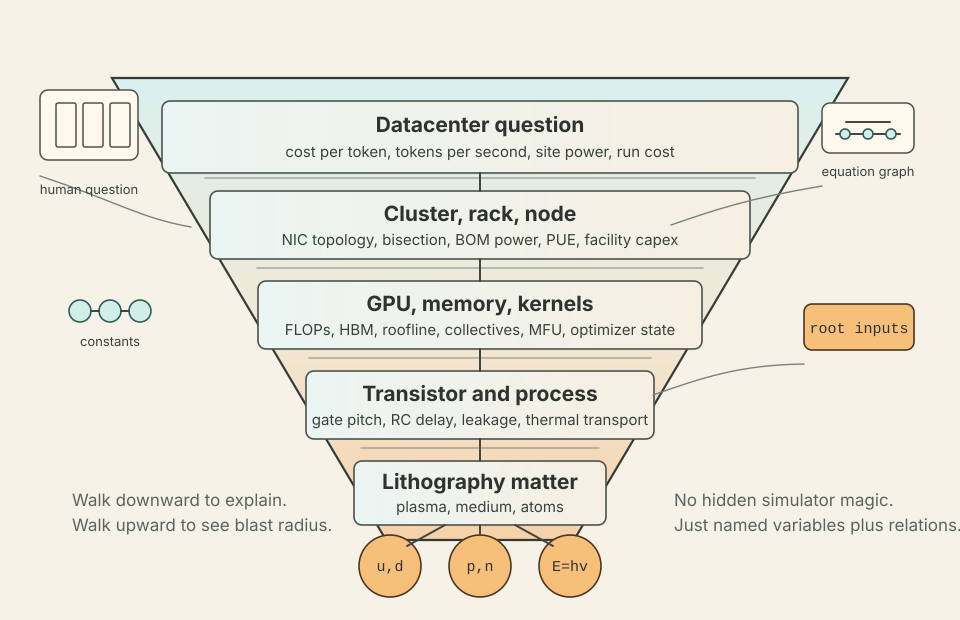

# gpu_stack

gpu_stack is an equation graph of the AI training stack, 1517 variables and 950 equations from datacenter cost down to chip physics, plus a small experimental program: a 1.9M-parameter model trained on one laptop GPU, and a simulator of what that training would do across several datacenters. The scale is small, and AI agents wrote most of it and judged their own results, unreliably in both directions. So the project was audited and re-judged from the raw files, in public. What is worth your time is that record: what failed, what was under-sold, and how each claim gets checked. The graph is not a validated predictor. Every number below links to the file it came from.


**Site:** <https://cuuper22.github.io/gpu_stack-/> | **Observatory:** <https://cuuper22.github.io/gpu_stack-/observatory.html> | **Ledger:** [EVIDENCE.md](EVIDENCE.md) | **Program:** [RESEARCH.md](RESEARCH.md) | **Next steps:** [ROADMAP.md](ROADMAP.md)

## What holds up

| Finding | Number | Source |
|---|---|---|
| `periodic_local` (two sites train alone, average weights every 8 steps) beat synchronous training on held-out loss (NLL, lower is better) in every stress family. Cause unknown: no control arm exists. | 10 of 10 families, -0.0187 [-0.0201, -0.0174], at 0.375x the bytes | [EVIDENCE](EVIDENCE.md#sc1-the-controller-loses-the-gates-were-mostly-unreachable) |
| Sparse checkpointing with survivor continuation used a little less energy, with a valid meter. Small, six pairs, one GPU. | energy 0.970 [0.940, 0.999], work -3.0%, NLL +0.0033 | [EVIDENCE](EVIDENCE.md#pw2-real-but-narrower-than-stated) |
| The graph counts a model's parameters from its architecture. | median error 0.0003 on 11 published models | [V002](experiments/v002-graph-published-runs/RESULT.md) |
| Hand checks of the economics path and 6ND FLOPs (6 x parameters x tokens) match published values. | two Pythia cost packs to 4 digits | [audit](analysis/graph-audit/REPORT.md) |
| Self-checks worked: two LC2 runs stopped on invalid setups, PW1 threw out its own power data. NVML (the GPU power API) updates every 0.494 s, not the 20 ms requested. | 25x slower than asked | [EVIDENCE](EVIDENCE.md#good-results-that-were-under-sold) |

## What doesn't

| Claim | What the evidence says | Source |
|---|---|---|
| The adaptive controller beats the simple baseline. | It lost to `periodic_local`: worse NLL in 6 of 6 families, 2.05x the bytes. | [EVIDENCE](EVIDENCE.md#sc1-the-controller-loses-the-gates-were-mostly-unreachable) |
| The controller "abstained" when out of its depth (104 times). | Scenario setup put the compute rate below the calibration floor. Abstaining changed no action. | [EVIDENCE](EVIDENCE.md#sc1-the-controller-loses-the-gates-were-mostly-unreachable) |
| LC1 falsified survivor continuation. | LC1 never tested it: the per-FLOP estimator was biased and every run hit the target at tick 32. | [EVIDENCE](EVIDENCE.md#lc1-the-test-could-not-see-the-hypothesis) |
| LC3 showed adaptive costs more energy. | Undetermined. 1.068 [1.002, 1.134] on a sampled meter, 1.023 [0.985, 1.063] on the valid counter. The 1.05 bar passed only 38% of the time with zero real difference. | [EVIDENCE](EVIDENCE.md#lc3-one-noisy-gate-decided-the-verdict) |
| PW2 attributed the energy penalty to checkpoint snapshots. | Replay compute is the biggest term (57%, snapshots 23%), and one of three gates is vacuous. | [EVIDENCE](EVIDENCE.md#pw2-real-but-narrower-than-stated) |
| The graph predicts training time. | As shipped it was 3x too fast (median error 0.682). With a 40% MFU (hardware utilization) prior it gets 0.218, the same as plain 6ND at 40% MFU (0.219). | [V002](experiments/v002-graph-published-runs/RESULT.md) |
| Root debt (how many variables depend on a root input) ranks what matters. | The top 20 are all lithography, and none of them moves cost per token. | [S001](experiments/s001-graph-sensitivity/RESULT.md) |
| 950 equations model the stack. | 538 (57%) reach no headline number. Shipped scenarios run 78. The nuclear and quark layer has zero numeric effect. | [audit](analysis/graph-audit/REPORT.md) |
| Equations are trustworthy. | The audit found 4 wrong ones (pipeline bubbles, hierarchical allgather, MLA KV cache, interleaved bubble). All 4 are fixed and have regression tests. | [audit](analysis/graph-audit/REPORT.md) |
| E003-E006 are ready to run. | Their gates cannot pass or fail as written (some need 299 or more clean events, some are too lax to ever fail). | [P001](experiments/p001-protocol-power-audit/RESULT.md) |
| The simulator is checked. | Until V001 reports, it is not. Its builder found a legal failure trace that makes the recovery runtime raise. | [V001 protocol](experiments/v001-simulator-known-results/protocol.md) |

## How the project checks itself

- **Frozen protocols.** For P001, S001, V002, V001 and R001, the protocol was committed before any result. Results landed later in git for P001 (`c3dfe91` then `d1d58c8`), S001 (`99c2e95` then `de57f2f`) and V002 (`c8801ea` then `0866736`). V001 (`38babe1`) and R001 (`0540632`) are running. Check with `git log`. Git order is checkable, not tamper-proof.
- **The old runs were not preregistered.** For E001 and E002, protocol and results share commits, minutes to hours after the runs. Only the E003-E006 protocols (`7b13f73`) predate results, and they have none. The word is not used for the early runs here.
- **An evidence ledger.** [EVIDENCE.md](EVIDENCE.md) re-judges every run with results. It copies each original verdict verbatim, then says HOLDS, OVERTURNED, UNDETERMINED or MEASUREMENT INVALID, with a confidence and what would settle it. It reproduces all 39 original bootstrap intervals exactly.
- **History is kept.** Result files and original verdicts are never edited. New analysis is added beside them and labeled post-hoc. The [results log](docs/research/results-log.md) records artifacts and hashes.

## The graph



Pick one number at the top, such as `econ.cost.per_token`, and collect everything it depends on. The shape is a cone: one question at the tip, hundreds of inputs at the base. Every variable has units and a reference. A root input is a variable nothing in the graph defines, so a person has to supply it. Only 24 universal constants are constants. Everything else is a variable.

**Good for:** tracing which inputs and equations sit under a number; checking units (884 of 950 equations have a unit check); finding which scenario values a result silently depends on; reproducing a hand calculation like 6ND FLOPs.

**Not good for:** predicting a real run's time, power or money (see the tables above); ranking what to measure next by root debt; anything about lithography, nuclear or quark physics, which no preset connects to a headline number.

## Try it in 60 seconds

```bash
python -m pip install -e ".[dev]"
python -m gpu_stack.cli stats
```

```text
Registry stats:
  systems        16
  variables      1517
  constants      24
  equations      950
  root_inputs    619
  leaves         259

Coverage:
  non_constant_variables         1493
  with_sp_units                  1493
  with_references                1493
  equations_with_references      950
  equations_with_unit_check      884
```

Leaves are variables nothing else depends on. Next, root debt by family (output trimmed to the first five columns):

```bash
python -m gpu_stack.cli root-debt --families --limit 5
```

```text
total_weight  root_count  family                                      boundary_category  primitive_boundary
        3000          15  physical.lithography.medium                 primitive-root     True
        2185          11  physical.lithography                        primitive-root     True
        1943           8  physical.lithography.source_plasma_drive    primitive-root     True
        1866          18  physical.mosfet                             primitive-root     True
        1293           8  physical.process                            primitive-root     True
```

Three of the five top families are lithography, which S001 found has no influence on cost per token. Treat this ranking as a count, not an importance.

```bash
python -m gpu_stack.cli scenario-report scenarios.pythia_70m_dgx_h100_us_2024_industrial_energy_floor_cost
```

```text
  tokens_per_second: ok target=training.tokens_per_sec value=7495672.60138477 missing=0 ...
  job_dc_power: ok target=econ.job.dc_power value=10200.0000000000 missing=0 ...
  run_power_cost: ok target=econ.run.power_cost value=9.21602308575190 missing=0 ...
  cost_per_token: ok target=econ.cost.per_token value=3.07310647422680e-11 missing=0 ...
```

That is Pythia-70M on one 8-GPU H100 node: 7.5M tokens/s, 10.2 kW, about $9 of electricity for the run (US 2024 industrial price). The cost line is electricity only, so a lower bound. These are model outputs, not measurements. The throughput uses a 40% MFU, an assumption labeled in the preset ([S001](experiments/s001-graph-sensitivity/RESULT.md) found the pinned FLOP rate is one of the inputs that moves cost per token most). Run `python -m pytest -q` for the tests (a few minutes).

## Experiments

| Code | Question | Status |
|---|---|---|
| E001 | Can a run spread across flaky datacenters keep learning as well as one cluster? | Ran as LC1-LC3 and SC1, plus two modeled screens that only read their inputs back. Mixed. [Ledger](EVIDENCE.md). |
| E002 | Can checkpoint timing shape a rack's power draw? | PW1 invalid, PW2 a small valid local result, PW3 (real rack) never run: no hardware. |
| E003 | Can failures be handled by how much they hurt learning? | Protocol only. P001 says its gates cannot pass or fail as written. |
| E004 | Should an inference fleet move requests while serving them? | Protocol only. Same P001 finding. |
| E005 | Can mixed hardware plus architecture co-design win under a power cap? | Protocol only. Same P001 finding. |
| E006 | Can an inference fleet act as a firm, grid-responsive load? | Protocol only. Same P001 finding. |
| R001 | Do the LC3 and SC1 learning results replicate on CPU with fresh seeds and an averaging control? | Running, protocol frozen at `0540632`. <!-- R001-RESULT --> |
| V001 | Does the simulator reproduce known results (Young/Daly checkpointing, queueing theory, Llama 3 failure rate)? | Running, protocol frozen at `38babe1`. <!-- V001-RESULT --> |
| V002 | Does the graph match published training runs? | Done. Fails as shipped, equals 6ND with a prior. [Result](experiments/v002-graph-published-runs/RESULT.md). |
| S001 | Which inputs move the headline outputs? | Done. Not lithography. [Result](experiments/s001-graph-sensitivity/RESULT.md). |
| P001 | Can the E003-E006 gates pass or fail at all? | Done. All four inadequate as written. [Result](experiments/p001-protocol-power-audit/RESULT.md). |

Codes: **LC** is learning calibration, **PW** power waveform, **SC** semantic consistency, **NLL** held-out loss in nats per byte (lower is better), **MFU** model FLOPs utilization, the share of peak math speed a run reaches.

<details>
<summary>Python examples (each one runs)</summary>

```python
import gpu_stack
from gpu_stack import Registry, subgraph

target = Registry.variables["econ.cost.per_token"]
cone = subgraph(target, direction="dependencies")
print(target.name, len(cone))   # econ.cost.per_token 698 (289 of them root inputs)
roots = sorted((v for v in cone if v.is_root_input), key=lambda v: v.name)
for var in roots[:3]:
    print(var.name, f"[{var.units}]")
```

```python
from gpu_stack.presets import scenarios

report = scenarios.dense_training_cost_fixture.evaluate_targets([
    ("tokens_per_second", "training.tokens_per_sec"),
    ("cost_per_token", "econ.cost.per_token"),
])
print(report.status)  # ok; 6666666.67 tokens/s and 3.000078e-06 $/token
```

That fixture is synthetic round numbers for testing the resolver. It is not vendor data.

```python
import sympy as sp
from gpu_stack import Registry

node = Registry.equations["cluster.eq.node_peak_flops"].evaluate_rhs({
    Registry.variables["cluster.node.n_gpus"].symbol: 8,
    Registry.variables["gpu.peak_flops"].symbol: sp.Float(15e15),
})
rack = Registry.equations["cluster.eq.rack_peak_flops"].evaluate_rhs({
    Registry.variables["cluster.rack.n_nodes"].symbol: 9,
    Registry.variables["cluster.node.peak_flops"].symbol: node,
})
print(sp.N(rack))  # 1.08e+18
```

```python
from gpu_stack import Registry, subgraph, to_dot, find_cycles, topological_sort

print(find_cycles(), len(topological_sort()))   # [] 1517
cone = sorted(subgraph(Registry.variables["econ.cost.per_token"], direction="dependencies"), key=lambda v: v.name)
print(to_dot(cone)[:120])                       # Graphviz text
```

</details>

<details>
<summary>Design rules</summary>

1. Only universal physics constants are `Constant`s. Clocks, voltages, GPU counts and tariffs are `Variable`s.
2. Every scope registers itself on import, so nothing exists off the books. `gpu_stack.scopes.SCOPE_MODULES` is the load order.
3. A root input is visible modeling debt: decompose it, source it, or leave it as a named scenario boundary.
4. Measurements, assumptions, modeled values and priors are different artifact classes.
5. Calibration and evaluation IDs may not overlap. A policy sees observable state, never simulator truth.
6. A virtual screen can reject a mechanism. It cannot validate a real datacenter claim.
7. A result with missing evidence stays inconclusive, even when one threshold looks good.

</details>

<details>
<summary>Repository layout</summary>

```text
.
├── README.md  EVIDENCE.md  RESEARCH.md  ROADMAP.md  PRODUCT.md  DESIGN.md  CHALLENGE.md
├── analysis/      graph audit and the re-analysis script behind EVIDENCE.md
├── experiments/   protocols and results: e001-e006, r001, v001, v002, s001, p001
├── docs/          GitHub Pages site (index, observatory), data, results log
├── evals/         WebMCP eval cases
├── scripts/       data projection for the site
├── tests/
└── gpu_stack/     core/ scopes/ presets/ research/ (simulator and experiment engines), cli*.py
```

</details>

## Current Snapshot

<details>
<summary>Registry numbers (checked against the live registry by <code>gpu_stack/docs_stats_check.py</code>)</summary>

| Signal | Value |
|---|---:|
| Systems | 16 |
| Variables | 1517 |
| Constants | 24 |
| Equations | 950 |
| Root inputs | 619 |
| Leaves | 259 |
| Cycles | 0 |
| Topological order length | 1517 |
| Hard audit failures | 0 |
| Non-constant variables with `sp_units` | 1493 |
| Non-constant variables with references | 1493 |
| Equations with references | 950 |
| Equations with unit checks | 884 |
| Root-debt families | 151 |
| Package version | 0.27.0 |

</details>

[CHANGELOG.md](CHANGELOG.md) has version history. The WebMCP challenge entry for the observatory is in [CHALLENGE.md](CHALLENGE.md).
