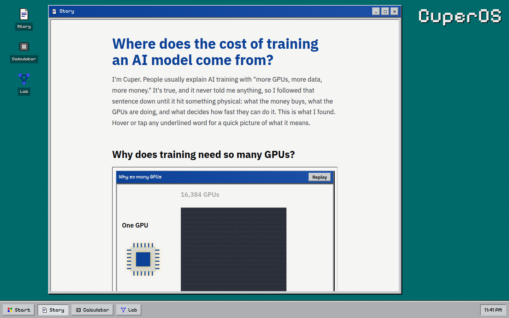

# gpu_stack

**Where does the cost of training an AI model come from?**

I'm Cuper. People usually explain AI training with "more GPUs, more data, more money." It's true, and it never told me anything, so I followed that sentence down until it hit something physical: what the money buys, what the GPUs are doing, and what decides how fast they can do it. This repository is the map I built on the way, a calculator that runs on it, and a small lab where I tried training across unreliable datacenters.

The easiest way in is the site, which tells the story with pictures you can play with and a quick explanation behind every technical word:

**<https://cuuper22.github.io/gpu_stack-/>**



## What I found

**The bill collapses into one short line.** Training needs about 6 arithmetic operations per model parameter per token it reads. Divide that by how fast your GPUs really run and multiply by what an hour of GPU costs you. The chip's speed on paper, the share of that speed you actually get, and the size of the model move the cost by the same amount, because each appears in that line once. After those comes how long you keep the hardware before replacing it.

**The share of speed you actually get is the one people underestimate.** The spec sheet number is a ceiling. Meta reports about 40 percent for Llama 3, and that counts as good.

**Electricity is a small slice.** For a 7 billion parameter model trained on 2 trillion tokens on 1,024 H100s, power and cooling come to about 6 percent of the cost. The rest is expensive hardware gradually becoming old hardware.

**How the chip is made doesn't change the bill.** The map once went down to lithography, atoms and even quarks. All of it reaches the cost through one number, how fast the GPU is, and that number is already on the spec sheet. I removed the quarks and kept a short layer on how chips are printed.

**The calculator is as good as a rule of thumb, and no better.** Checked against 27 published training runs (Llama, Pythia, BLOOM, OLMo and others), it usually lands within about a fifth of the reported GPU time. So does "6 times parameters times tokens, divided by 40 percent of the GPU's top speed." Energy and money can't be checked fairly, because published figures for them are mostly hours multiplied by a rated power or a rental price.

**Spreading a run across flaky datacenters costs something whichever way you do it.** On a tiny model trained on my laptop GPU, with the sites and outages simulated, a controller I wrote lost to simply letting each site train alone and averaging their weights every 8 steps. That plain approach also beat keeping the sites in lockstep, which a rerun on fresh seeds traced to a known effect: averaging smooths the jitter of training at a fixed learning rate. Letting the surviving site keep going through an outage did a few percent less work and learned about 1 percent worse.

## Try it

```bash
python -m pip install -e .
gpu-stack estimate --params 7e9 --tokens 2e12 --gpu H100-SXM --gpus 1024
```

```text
7 billion parameters, 2 trillion tokens, 1,024 x H100-SXM
(MFU 40%, PUE 1.2, electricity $0.0813/kWh)
  Training time              2.4 days
  GPU-hours                  58,958
  Energy                     49.5 MWh
  Electricity cost           $4,026
  Hardware cost (amortized)  $67,090
  Total cost                 $71,116
  Cost per million tokens    $0.0356
```

Add `--explain` to see what each number is made of, down to the equation, and whether each input was something you entered, a cited hardware spec, or an assumption. The same from Python:

```python
from gpu_stack.calculator import estimate, format_breakdown

result = estimate(params=7e9, tokens=2e12, gpu="H100-SXM", n_gpus=1024)
print(round(result.training_days, 1), round(result.total_cost))
print(format_breakdown(result))
```

`python -m pytest -q` runs the tests (a couple of minutes).

## What's in here

```text
gpu_stack/
  core/          the equation engine: variables with units, equations, a resolver
  scopes/        the map itself: training, GPUs, memory, networking, cooling, cost, chips
  presets/       hardware specs and example scenarios, with sources
  calculator.py  the calculator, built on the map
  drivers.py     which inputs move the cost the most
  research/      the lab: a small simulator of training across datacenters with outages
docs/            the site (Story, Calculator, Lab)
experiments/     the lab's input scenarios
```

## How I built it

I built this with AI coding agents. They write quickly, and they grade their own work unreliably in both directions: some real results were marked as failures because the pass mark was impossible, and some accidents were written up as insights. Going back through every result from the raw files taught me more than building the map did, and it's why the conclusions above are smaller than the early drafts claimed. What's left to fix is in [ROADMAP.md](ROADMAP.md).

<details>
<summary>The map in numbers</summary>

```text
Registry stats:
  systems        16
  variables      1267
  constants      18
  equations      701
  root_inputs    583
  leaves         241

Coverage:
  non_constant_variables         1249
  with_sp_units                  1249
  with_references                1249
  equations                      701
  equations_with_references      701
  equations_with_unit_check      642
```

## Current Snapshot

| Signal | Value |
|---|---:|
| Systems | 16 |
| Variables | 1267 |
| Constants | 18 |
| Equations | 701 |
| Root inputs | 583 |
| Leaves | 241 |
| Cycles | 0 |
| Topological order length | 1267 |
| Hard audit failures | 0 |
| Non-constant variables with `sp_units` | 1249 |
| Non-constant variables with references | 1249 |
| Equations with references | 701 |
| Equations with unit checks | 642 |
| Root-debt families | 142 |
| Package version | 0.27.0 |

</details>
